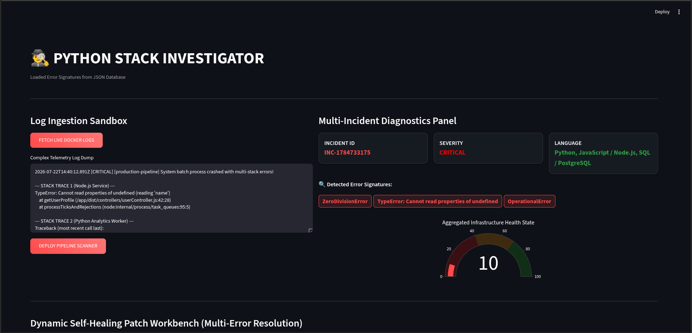
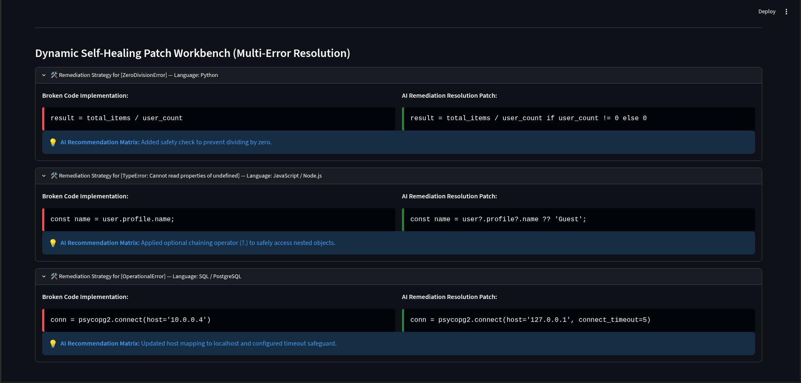

# **Python Stack Investigator - Author ALI HUSNAIN** 

<p align="center">
  
</p>

<p align="center">
  
  
  
  
  
  
  
  
</p>

## **🕵️‍♂️ Multi-Language AI Log Investigator & Forensic Dashboard**

**Python Stack Investigator** is an enterprise-grade, real-time log ingestion and incident response dashboard. It goes beyond simple log parsers by analyzing multi-stack production crashes, directly extracting live Docker container telemetry, and offering automated side-by-side code remediations.

> **"Accelerate Mean Time to Resolution (MTTR) - Ingest multi-language logs, calculate infrastructure health, and patch code instantly."**

<br>

## ⚠️ **DISCLAIMER**

**This tool is intended for educational purposes, DevOps security research, and authorized incident response testing. Always ensure proper authorization before monitoring or attaching to live container streams in production networks.**

<br>

## 🚀 **Key Features**

### **🔧 Multi-Language Error Signature Analysis**
- **Language Detection**: Automatically classifies stack traces from Python, JavaScript / Node.js, Java, C++, Rust, and SQL.
- **Dynamic Signature Matching**: Parses log dumps against an external JSON matrix (`error_database.json`) for instant signature classification.
- **Runtime Anomaly Fallback**: Gracefully flags unmapped errors with fallback investigation protocols.

### **🌐 Live Docker Telemetry Integration**
- **Docker Engine API**: Direct integration using Docker SDK to harvest live container logs.
- **Automated Container Scanning**: Scans active Docker containers for anomalous traces in real time with a single click.

### **📊 Real-Time Infrastructure Diagnostics**
- **Aggregate Health State**: Dynamic Plotly gauge chart mapping infrastructure health (0%–100%).
- **Severity Classification**: Categorizes incidents automatically into `CRITICAL` or `HIGH` based on cascading signatures.
- **Language Tracking**: Dynamic status cards displaying all detected programming languages in the current crash trace.

### **🩹 Self-Healing Patch Workbench**
- **Side-by-Side Remediation**: Displays buggy implementations alongside AI-generated resolution patches.
- **Actionable Advice**: Provides detailed recommendation notes to guide developers through manual logic reviews.

### **🎨 Modern Interactive Cyberpunk Interface**
- **Streamlit Ingestion Sandbox**: Clean side-by-side layout for log pasting and live diagnostics.
- **Session State Control**: Persists harvested Docker telemetry across UI interactions.

<br>

## 📸 **Dashboard Screenshots**

<p align="center">
  
</p>

<p align="center">
  <em>Figure 1: Real-time Incident Diagnostics Panel, Infrastructure Health Gauge, and Self-Healing Patch Workbench.</em>
</p>

<br>

## 📦 **Installation Guide**

### **System Requirements**
- Python 3.9 or higher
- Docker Engine / Docker Desktop (Running for live telemetry features)
- Linux / macOS / Windows

### **Basic Installation**

```bash
# Clone the repository
git clone [https://github.com/alihusnain404/Python-Stack-Investigator.git](https://github.com/alihusnain404/Python-Stack-Investigator.git)

# Navigate to the tool's directory
cd Python-Stack-Investigator

# Install Python dependencies
pip install -r requirements.txt

```

### **Virtual Environment Installation (Recommended)**

```bash
# Create virtual environment
python3 -m venv venv

# Activate virtual environment
source venv/bin/activate    # Linux/macOS
# OR
venv\Scripts\activate       # Windows

# Install dependencies
pip install -r requirements.txt

```

## 🛠 **Usage & Launch**

### **Launch the Investigator Dashboard**

```bash
streamlit run stack.py

```

### **Accessing the Web GUI**

Open your web browser and navigate to:

```text
http://localhost:8501

```

## 🧪 **Testing Sandbox (`/docker-demo`)**

```bash
# 1. Navigate to the demo sandbox
cd docker-demo

# 2. Build the testing container
docker build -t test-buggy-app .

# 3. Run the container to produce continuous multi-stack crash logs
docker run -d --name live-crash-demo test-buggy-app

```

> **How to Test in Dashboard:** Go to the Streamlit UI, click **`🔌 FETCH LIVE DOCKER LOGS`**, then click **`🚀 DEPLOY PIPELINE SCANNER`** to see real-time analysis!

## 📁 **Repository Structure**

```text
.
├── stack.py                             # Core Streamlit Dashboard & Investigator Agent
├── error_database.json                  # JSON Knowledge Base mapping signatures to patches
├── requirements.txt                     # Python project dependencies
├── README.md                            # Project documentation
├── Icon/                                # Banners and UI Screenshots
│   ├── Banner.png                       # Main Header Banner
│   └── Banner2.png                      # UI Dashboard Screenshot
└── docker-demo/                         # Live Docker container testing sandbox
    ├── app_with_error.py                # Test script generating multi-language crash traces
    └── docker_telemetry_harvester.py    # Docker configuration for testing

```

## 🔧 **Extending the Knowledge Base**

You can add new error signatures without modifying the Python source code by editing `error_database.json`:

```json
{
  "YourCustomErrorSignature": {
    "language": "Python",
    "buggy_code": "def process(val):\n    return val.data",
    "patched_code": "def process(val):\n    return getattr(val, 'data', None)",
    "remedy": "Check object attribute existence before accessing."
  }
}

```

## 🤝 **Contributing**

Contributions, error signatures, and UI enhancements are welcome!

1. Fork the Repository
2. Create your Feature Branch (`git checkout -b feature/NewSignature`)
3. Commit your Changes (`git commit -m 'Add support for MemoryLeakException'`)
4. Push to the Branch (`git push origin feature/NewSignature`)
5. Open a Pull Request

## 📄 **License**

This project is licensed under the **MIT License** - see the [LICENSE](https://www.google.com/search?q=LICENSE) file for details.

## 🙏 **Acknowledgements**

* **Streamlit** - For rapid data application framework
* **Plotly** - For interactive health charts
* **Docker SDK for Python** - For container log integration

---

## **MADE WITH ❤️ BY AUTHOR ALI HUSNAIN**
